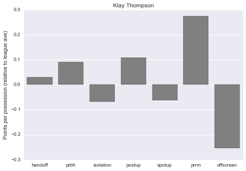
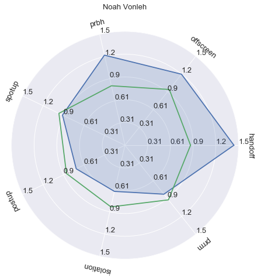

# chris-analysis
Preliminary work on defense in the NBA

## Example plots

Plots of how well players can defend each play type (bar and radar plots).  Just swap out player names to look up player-of-interest

in `explore.py`
```python
plays, all_data, ave_ppp = organize_playdata()
make_player_barplot('Klay Thompson', plays, ave_ppp)
make_radar('Noah Vonleh', all_data, ave_ppp)
```

Output:




## Current TODO
* Fingerprint of teams
* How have players-fingerprint changed when they changed teams? (Find insightful examples)
